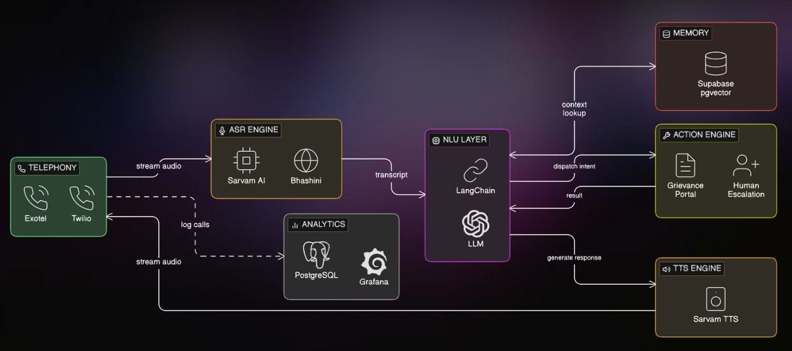

# VaaniAI — Multilingual AI Inbound & Outbound Calling Agent

> **Domain:** Digital Democracy | **Team:** Code Blizzards | **Institution:** PCCE, Verna, Goa
>
> Built for India Innovates 2026

---

## Problem Statement

India's public service infrastructure handles **100,000+ calls daily** (MCD alone) — all routed through overloaded human agents or rigid IVR systems ("press 1, press 2"). The result:

| Pain Point | Reality Today |
|---|---|
| Average wait time | 15–45 minutes |
| Languages supported | 2–3 (Hindi, English only) |
| 24/7 availability | No (8am–8pm only) |
| Grievance acknowledgement | 15–45 days |
| Monthly call capacity | ~50,000 (staff-limited) |
| Outbound campaigns | Manual, weeks to execute |
| Analytics | None / retrospective |

**Root Causes:**
- Overloaded human agents cannot scale for 20 million Delhi residents
- IVR systems are rigid, non-conversational, and frustrating
- Language barrier — Hindi, Punjabi, Urdu, Bhojpuri, English all spoken in Delhi
- No memory — citizens repeat their complaint on every call
- Zero real-time analytics — no ward-level visibility
- No proactive outreach — surveys and reminders require massive manual effort

---

## Solution

**VaaniAI** is an end-to-end AI-powered telephony platform for citizen services, grievance redressal, and outreach campaigns — enabling any government to deploy intelligent, multilingual voice agents with contextual memory, real-time NLU, escalation handling, and live analytics.

| Metric | Current State | With VaaniAI |
|---|---|---|
| Average Wait Time | 15–45 min | < 5 seconds |
| Languages Supported | 2–3 | 12+ |
| 24/7 Availability | No | Yes, always-on |
| Grievance Acknowledgement | 15–45 days | < 60 seconds |
| Monthly Call Capacity | ~50,000 | Unlimited |
| Outbound Campaigns | Manual, weeks | 10K calls in < 1 hour |
| Analytics | Retrospective | Real-time, ward-level |

---

## Architecture



```
Citizen Call (Twilio / Exotel / SIP)
         │
         ▼
   ┌─────────────┐
   │  ASR Module │  ← Sarvam AI + Bhashini (10+ Indian languages)
   └──────┬──────┘
          │ Text
          ▼
   ┌─────────────┐
   │  NLU Module │  ← LangChain + GPT-4o / Llama 3 (intent, entities, dialogue)
   └──────┬──────┘
          │
    ┌─────┴─────┐
    │           │
    ▼           ▼
┌────────┐  ┌──────────┐
│ Memory │  │Escalation│  ← pgvector (citizen history) + emotion detection
└────────┘  └──────────┘
          │
          ▼
   ┌─────────────┐
   │  TTS Module │  ← Sarvam TTS + ElevenLabs (Indian-accent voice)
   └──────┬──────┘
          │ Audio
          ▼
    Citizen hears response
          │
          ▼
   ┌─────────────┐
   │  Analytics  │  ← Grafana + Metabase + PostgreSQL (real-time dashboards)
   └─────────────┘
```

---

## Features & USPs

### Core Features
- **India-First Multilingual AI** — Supports 12+ Indian languages including Hinglish, integrated with Bhashini without custom training
- **Real-Time Contextual Memory** — Stores citizen interactions via vector DB for instant recall on callbacks — zero repeat context
- **Smart Escalation with Context Transfer** — Detects distress via tone/sentiment analysis; transfers to human agents with full conversation summary
- **Sub-2-Second Response Latency** — Streaming ASR + low-latency LLM inference via Groq
- **Unlimited Scale Outbound** — 10,000+ simultaneous AI-driven calls for surveys and campaigns
- **Live Ward-Level Analytics** — Real-time dashboards monitoring complaint trends and sentiment scores per ward
- **Cost Efficiency** — ₹0.40/call vs ₹18,000–25,000/month per human agent → ROI in under 3 months at MCD scale
- **Secure & Compliant** — Phone number-based caller verification, encrypted citizen data, role-based access, full audit logs

### Extended Features
- **WhatsApp Photo Integration** — Post-call link to attach photo/video evidence to tickets
- **Missed Call Status Tracker** — Citizen gives a missed call → gets automatic callback with ticket status (works on any phone, no app needed)
- **Proactive Disaster Alerts** — Outbound calls to flood-prone ward citizens during monsoon with ward-specific advisories
- **Post-Resolution Survey** — Automated callback after ticket closure for service rating → ward-level accountability scores
- **Duplicate Complaint Detection** — AI groups multiple complaints about the same issue into one high-priority ticket
- **Vernacular FAQ Bot** — Citizens ask general service questions in any language without creating a ticket

---

## Technology Stack

| Layer | Technology |
|---|---|
| **Telephony** | Twilio, Exotel, Knowlarity, SIP |
| **ASR / STT** | Sarvam AI, Bhashini, OpenAI Whisper |
| **LLM / NLU** | GPT-4o, Llama 3, LangChain, Groq |
| **Memory** | Supabase pgvector, Pinecone |
| **TTS** | Sarvam TTS, ElevenLabs |
| **Channels** | SMS Gateway, Missed Call Service, WhatsApp |
| **Backend** | FastAPI (Python), WebSockets |
| **Analytics** | Grafana, Metabase, PostgreSQL |
| **Deployment** | Docker, AWS / Azure, Vercel |

---

## Project Structure

```
VaaniAI/
├── README.md
├── index.js              # Prototype: Express server (Twilio webhooks)
├── makeCall.js           # Prototype: Outbound call initiator
├── backend/              # FastAPI backend (Python)
│   └── main.py           # API routes, call orchestration
├── asr/                  # ASR/STT integration
│   └── sarvam.py         # Sarvam AI + Bhashini connector
├── nlu/                  # NLU & dialogue management
│   └── agent.py          # LangChain agent, intent classification
├── tts/                  # Text-to-Speech
│   └── synthesizer.py    # Sarvam TTS + ElevenLabs integration
├── memory/               # Citizen conversation memory
│   └── vector_store.py   # pgvector / Pinecone connector
├── analytics/            # Analytics & dashboards
│   └── dashboard.py      # Grafana / Metabase data pipeline
├── channels/             # Multi-channel support
│   └── whatsapp.py       # WhatsApp integration
├── app/                  # Next.js analytics dashboard (frontend)
│   └── page.jsx
└── data/
    └── prompt.md         # System prompts
```

---

## Prototype

The current working prototype demonstrates the core call loop:

- **Stack:** Node.js + Express + Twilio + Gemini 2.0 Flash + MongoDB Atlas
- **Flow:** Outbound call → speech capture → Gemini AI response → TTS playback → transcript saved to MongoDB
- **Tested with:** Real phone calls via Twilio trial account

### Run Locally

```bash
# Clone the repo
git clone https://github.com/<your-org>/VaaniAI.git
cd VaaniAI

# Install dependencies
npm install

# Configure environment
cp .sample_env .env
# Fill in: TWILIO_ACCOUNT_SID, TWILIO_AUTH_TOKEN, TWILIO_PHONE_NUMBER, GEMINI_API_KEY, MONGODB_URI

# Expose local server (dev)
ngrok http 3000

# Start the server
node index.js

# Make a test call
node makeCall.js
```

### Environment Variables

```env
TWILIO_ACCOUNT_SID=your_sid
TWILIO_AUTH_TOKEN=your_token
TWILIO_PHONE_NUMBER=+1xxxxxxxxxx
GEMINI_API_KEY=your_key
MONGODB_URI=your_mongodb_atlas_uri
```

---

## Team

| Name | Role |
|---|---|
| Tanmay Desai | Backend & AI Integration |
| Rhugved Dangui | ASR & NLU |
| Sahil Shinde | TTS & Voice Pipeline |
| Seon Boadita | Analytics & Frontend |
| Fayaz Khan | Channels & Deployment |

**Institution:** PCCE (Padre Conceição College of Engineering), Verna, Goa

---

## Impact

- **Target:** Municipal call centers handling millions of grievances (starting with MCD Delhi)
- **Cost:** ₹0.40/call vs ₹18,000–25,000/month per human agent
- **Scale:** From 50,000 calls/month (human-limited) → unlimited with AI
- **Equity:** Every Indian citizen, in their own language, gets instant access to government services 24/7

---

*India Innovates 2026 | Domain 2: Digital Democracy*
